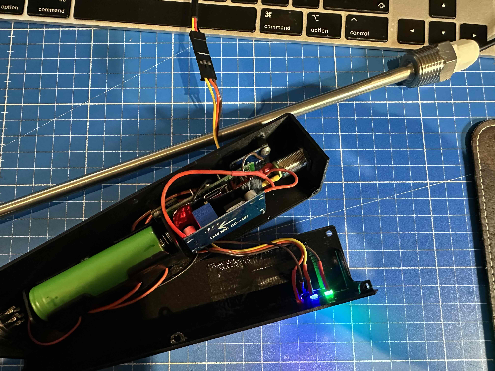

# 🚀 HasABrewery ESP32 Client

[]()
[](LICENSE)  
[](https://espressif.com/)\
[](https://www.arduino.cc/en/software)
[](https://platformio.org/)


**HasABrewery ESP32 Client** is an IoT-driven temperature monitoring system tailored for ambitious home brewers and small breweries. Built for **ESP32**, it enables real-time temperature logging using **DS18B20 sensors** and seamless integration with **MQTT**. It supports **both static power supply and battery operation**, ensuring uninterrupted monitoring.\
Now able to flash directly thru Arduino IDE or as usually thru Platform IO and VS Code\
Now with integrated deep_sleep you can measure your fermentation's temperature for even longer without worrying about battery levels - too easy, lads! 
- 📊 Click Here [**Web dashboard**](https://github.com/mirkohahn/hasabrewery-host) for real-time monitoring MQTT dashboard.

## 📌 Features

- ✅ **Supporting °F & °C**: Configure using imperial or metric units with a simple click.
- ✅ **Smart WiFi AP Selection**: Automatically connects to the strongest access point.
- ✅ **MQTT-Powered**: Publishes real-time temperature data to a broker.
- ✅ **Precision Monitoring**: Uses **DS18B20 sensors** for accurate readings.
- ✅ **Optimized for PlatformIO**: Easy flashing and configuration.
- ✅ **Supports Static & Battery Power**: Works seamlessly with both power sources.
- ✅ **Multi-sensor support** for multiple DS18B20 probes including ambient temperature.
- ✅ **Battery optimization** to extend operational runtime.

\
Click here to install using the [Arduino IDE](#📦-22-installation---arduino-ide) and here for [VS Code & Platform IO](#📦-12-installation---vs-code--platform-io)

The current build version for an ESP32 C3 has
````
RAM:   [=         ]  14.1% (used 46296 bytes from 327680 bytes)
Flash: [======    ]  59.9% (used 784701 bytes from 1310720 bytes)
````

## Table of Contents
- [Installation on VS Code & Platform IO](#📦-12-installation---vs-code--platform-io) | [Installation using Arduino IDE](#📦-22-installation---arduino-ide)
- [Project Structure](#🖥️-project-structure)
- [Wiring & Hardware](#🖼️-wiring--hardware)
- [Upcoming Features](#🔮-upcoming-features) | [Contribution](#📖-contribution) | [Support the Project](#⭐-support-the-project) | [License](#-📜-license)
- [Has A Brewery EcoSystem](#🌐-has-a-brewery-ecosystem)


## Changelog
| Version | Date       | Description               |
|---------|------------|---------------------------|
| 1.1.0   | 2025-04-13 | **🚨Status LED** support in Green, Red, Blue and **🪫 Battery Monitor** support via LED and MQTT, Updated config file, Preperation for CAN Bus (BeerCAN-Protocol), updated Time Zones for accurate local time stamps in messages|
| 1.0.3   | 2025-02-27 | Added Arduino files; now flashable thru Arduino IDE            |
| 1.0.2   | 2025-02-11 | Small bug fixes and updates       |
| 1.0.1   | 2025-02-08 | Added Ambient Temperature, Deep Sleep Mode and Imperial Units     |
| 1.0.0   | 2025-02-05 | Working V1 Version;      |


## 📦 (1/2) Installation - VS Code & Platform IO

### **1️⃣ Prerequisites**

- Install **PlatformIO** (recommended) or Arduino IDE
- Install ESP32 toolchain
- Clone the repository:
  ```sh
  git clone https://github.com/mirkohahn/hasabrewery-client-esp-temp.git
  cd hasabrewery-client-esp-temp
  ```

### **2️⃣ Configure WiFi & MQTT**
Copy/rename `src/template_config.h` to `src/config.h`. Then change it to meet your personal requirements and adjust it to your connection credentials and configurations. For example enter
  ```cpp
  #define WIFI_SSID "YourWiFiSSID"
  #define WIFI_PASSWORD "YourWiFiPassword"
  #define MQTT_BROKER "your.mqtt.host-address"
  #define MQTT_PORT 1883
  ```

If you don't want to mess with the code too much, this is the only part you need to adjust, so the thermometer can connect to your WiFi.


### **3️⃣ Flash to ESP32**
  ```sh
  pio run --target upload
  ```


## 📦 (2/2) Installation - Arduino IDE

### **1️⃣ Prerequisites**
- Install ESP32 Board Package to Arduino IDE
   -> `File` > `Preferences` 
  then add the following URL to `Additional Board Manager URLs`
```
https://raw.githubusercontent.com/espressif/arduino-esp32/gh-pages/package_esp32_index.json
```
- Go to `Tools` > `Board` > `Board Manager`
  Search for **ESP32** and install lates Espressif ESP32 package
- Install required libraries
   go to `Sketch` > `Include Library` > `Manage Libraries` search and install: `PubSubClient` (needed for MQTT messages)

### **2️⃣ Configure your IDE**
- Board:            ESP32C3 Dev Module
- Upload Speed:     115200
- Flash Mode:       QIO
- Port:             (Select the COM port shown for ESP32C3)
- CPU Frequency:    160MHz
- Partition Scheme: Huge APP (3MB No OTA/1MB SPIFFS)


### **3️⃣ Configure WiFi & MQTT**
Easily modify `src/config.h` to include your personal credentials and configurations:
  ```cpp
  #define WIFI_SSID "YourWiFiSSID"
  #define WIFI_PASSWORD "YourWiFiPassword"
  #define MQTT_BROKER "your.mqtt.host-address"
  #define MQTT_PORT 1883
  ```

and much more. You can choose and customize the topic under which the messages are send all from config.h

### **4️⃣ Flash to ESP32**
- select your board from `Tools` > `Board` > `eps32` > Select Your Board 
- click **Upload**

---

## 🛠 Usage
1. **Power on your ESP32 device**.
2. The system **scans and connects to the strongest WiFi AP**.
3. Temperature data is **published via MQTT**.
4. Use an MQTT client like **MQTT Explorer** to monitor the data.

---

## 🖥️ Project Structure
```
📦 hasabrewery-client-esp-temp
 ┣ 📂 include           # Header files
 ┣ 📂 lib               # External libraries (e.g., OneWire)
 ┣ 📂 src               # Source code
 ┃ ┣ 📄 main.cpp        # Main application logic
 ┃ ┣ 📄 config.h        # WiFi & MQTT configuration
 ┃ ┣ 📄 mqtt_handler.cpp # MQTT logic
 ┃ ┗ 📄 temperature_sensor.cpp # Sensor management
 ┣ 📄 platformio.ini    # PlatformIO configuration
 ┣ 📄 .gitignore        # Git ignore rules
 ┣ 📄 README.md         # Project documentation
 ┗ 📄 LICENSE           # License file
```

---

## 🖼️ Wiring & Hardware

### **Pinout Diagrams ESP32 C3 SuperMini and WROOM**
  
By default, **GPIO 4** is allocated for **OneWire communication**.

  
By default, **GPIO 4** is allocated for **OneWire communication**.


### **Wiring Diagram (ESP32 + Temperature Probe + Battery)**


The code uses the OneWire library supporting multiple DS18B20 on the GPIO data pin, By default both OneWire and therefore I use GPIO4 for temperature data. If any / an unknown DS18B20 thermometer is connected, this will be treated as the one used to measure the brew temperature with. When multiple thermometers are in use (e.g. for additional ambient temperature) the thermometer ID needs to be known and assigned in the code (not in config.h) directly for ease of use and better assignment of the use itself.
By default the thermometer looks for an ambient temp and a brew temp. The ambient temp ID needs to be assigned if you want to use it. 

In general though, all GPIO pins (as most other stuff) is changed/customized directly in config.h
A lot of the features (e.g. LED Status Lights, Battery Gauge, BeerCAN, etc) are purely optional. By default all features are enabled. If you want to disable certain features, simply set the feature to false '#define ENABLE_LED   false' in config.h

The project comes with this pin out (as shown in the picture above) 
| Pin #  | Function       | Comment               |
|---------|------------|---------------------------|
|GPIO0|BeerCAN TX Wire|optional, TBD|
|GPIO1|BeerCAN RX Wire|optional, TBD|
|GPIO4|Data Wire DS18B20|deafult by OneWire; not in config.h|
|GPIO8|SDA Pin Battery|Only / standard SDA line on ESP32 C3|
|GPIO9|SCL Pin Battery|Only / standard SCL line on ESP32 C3|
|GPIO10|Green|Common Cathode; Pin HIGH = LED on|
|GPIO20|Blue LED|Common Cathode; Pin HIGH = LED on|
|GPIO21|Red LED|Common Cathode; Pin HIGH = LED on|


### Status LED - General Overview
Eventhough the final implementation is still WIP the idea behind the LEDs is for you as a user to instantly see what your thermometer is doing in if needed troubleshoot.
Generally there are three states for LEDs: On, Off, Blinking; If an LED is on (green or blue) it is a good sign. Except if RED is on it indicates an issue.
Green is general status and WiFi related; blue is MQTT, transmition and sensor related. 5 blinks indicate scanner (WiFi or MQTT), 3 blinks usually indicate a connection.

A circle 🔴🔵🟢 indicates that an LED is constantly on. A square 🟥 🟦 🟩 with a leading number (e.g. 5x 🟩) indicates a blinking LED and the amount you can expect the LED to blink.
Here's a general overview of common LED patterns and their respective meaning
| Green    |Blue   |Red   |Meaning |
|----------|----------|------|-------|
|0|0|0| Device Off, or Deep Sleep|
|5x 🟩|0|0| Scanning for WiFi networks |
|3x 🟩|0|0| (new) WiFi / Access Point connected |
|0|0|🔴| No WiFi Network Found; no WiFi Connection|
|🟢|0|10x 🟥| WiFi Connection Failed |
|0|0|🟥| Known Network not found; Couldnt Connect |
|🟢|🔵|0| Connected to MQTT |
|🟢|5x 🟦|| MQTT Message Published |
|0|5x 🟦|🔴| Connection Failed |
|0|🔵|5x 🟥| MQTT Publish Failed |


### **Actual Device Setup**
I am a fan of modular designs and flexibility in my projects. To connect sensors and/or probes or actuators requiring 3 or less wires, I am usually using servo connectors. This allows to easily remove and/or exchange sensors. For this project, I have quite a selection of thermometers (e.g. one without the heatshrink to add to my fermenters thermowell and one in a seperate thermowell for the brewing process) (see picture for reference)

This is a picture of my personal setup. The current design and and models can be downloaded at [Printables](https://www.printables.com/model/1265398-esp32-smart-thermometer-case-handle-for-home-brewe/files). They fit all the components and have some add ons such as a mounting clip. Simply download, slice and print them at home. The picture below shows the printed handle; in it you can fit:
- GX16 plug
- Charging Module TP4056
- 18650 Cell & Cell Holder
- Battery Gauge INA219
- 12mm Push Button with LED
- LM2596 DC-DC Buck 
- ESP32 C3 SuperMini
- 3x 3mm round LED
- Design includes a cutout for USB-C charging via TP4056 and to feed through cable for DS18B20, holes to mount belt clip


---

## 🔮 Upcoming Features
- 🚎 **BeerCAN** Bus implementation for infinate wired scalability
- 📦 **OTA updates** for seamless firmware upgrades.

---

## 📖 Contribution
We welcome contributions! To contribute:
1. **Fork** the repository.
2. Create a **feature branch**:
   ```sh
   git checkout -b feature-new-cool-thing
   ```
3. **Make your changes** and commit:
   ```sh
   git commit -m "Added a new cool feature"
   ```
4. **Push to GitHub and open a Pull Request**!
### Create an New Issue

If you have feedback and/or feature requests, simply create a new issue in the repository

---

## ⭐ Support the Project!
If you find this project useful, please **star the repository ⭐, follow [my GitHub account](https://github.com/mirkohahn)**, and **engage with feedback**. Your support helps us improve and grow the project! 🚀🍻

---

## 📜 License
This project is licensed under the **Apache 2.0 License** – see the [LICENSE](LICENSE) file for details.


---

## 🌐 Has A Brewery Ecosystem
If you like to learn more about **Has A Brewery**, the project and resources, checkout other HasABrewery repositories:
| Name | Description |
|------|------------|
| [Has A Brewery Local Host](https://github.com/mirkohahn/hasabrewery-host) | Cloud backend for data storage and real-time analytics. |
| [Brewery Data Strucutre](https://github.com/mirkohahn/brew_data_structure) | Official website with product details and updates. |
| [Fermentation Chamber Controller](https://github.com/mirkohahn/hasabrewery-fermentation-chamber) | Full Controller for Fermentation & Conditioning Chamber |
| [Keezer / Kegerator Controller](https://github.com/mirkohahn/hasabrewery-keezer-controller) | Coming Soon... |

As well as our website & online tools, such as
| Name | Description |
|------|------------|
| [Get Started Guide](https://hasabrewery.com/get-started) | Full guide, overivew, tutorials and education on how to get started. |
| [Find Ingredients (e.g. Malt & Grinas)](https://hasabrewery.com/tools/ingredients/grain-finder) | Search & Filter over 1,000 grains for EBC, Beer Styles, Taste and more. |
| [Compare Ingredients against eachother](https://hasabrewery.com/tools/ingredients/compare-ingredients) | Benchmark and compare grains (hops, yeasts, etc) against eachother for educated recipe creation |
| [Calculate ABV thru Gravity](https://hasabrewery.com/tools/calculators/abv) | Online Calculator to get Alcohol by Volume from OG and FG gravity reading (SG and °P). |
| [Adjust Gravity Reading for Temp. Difference](https://hasabrewery.com/tools/calculators/hydro-temp-correct) | Calculater the adjustment for your Hydrometer Readings if made at higher/lower temperatures than calibrated. |
| [Look Up Your Local Water Profile](https://hasabrewery.com/tools/charts/water-profiles) | Browse ofer 5,200 water profiles and filter for your region. |

---

## 🎖️ Credits & External Libraries
This project wouldn't be possible without the help of other developers, making tools I utilized. Most libraries are referenced in .ini file. 
Additionally I used the **OneWire Library** for this project, which was cloned and adapted from:
- **OneWire Library**: [https://github.com/PaulStoffregen/OneWire](https://github.com/PaulStoffregen/OneWire)

---

 
# 🚀 Happy Brewing & Cheers! 🍻

