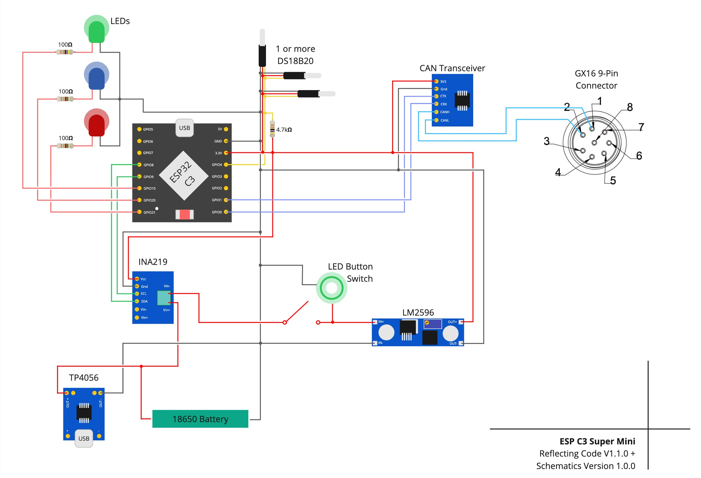

# 🚀 HasABrewery ESP32 Client

[]()
[](LICENSE)  
[](https://espressif.com/)

**HasABrewery ESP32 Client** is an IoT-driven temperature monitoring system tailored for ambitious home brewers and small breweries. Built for **ESP32**, it enables real-time temperature logging using **DS18B20 sensors** and seamless integration with **MQTT**. It supports **both static power supply and battery operation**, ensuring uninterrupted monitoring.
Now with integrated deep_sleep you can measure your fermentation's temperature for even longer without worrying about battery levels - too easy, lads! 
- 📊 Click Here [**Web dashboard**](https://github.com/mirkohahn/hasabrewery-host) for real-time monitoring MQTT dashboard.

## 📌 Features

- ✅ **Supporting °F & °C**: Configure using imperial or metric units with a simple click.
- ✅ **Smart WiFi AP Selection**: Automatically connects to the strongest access point.
- ✅ **MQTT-Powered**: Publishes real-time temperature data to a broker.
- ✅ **Precision Monitoring**: Uses **DS18B20 sensors** for accurate readings.
- ✅ **Optimized for PlatformIO**: Easy flashing and configuration.
- ✅ **Supports Static & Battery Power**: Works seamlessly with both power sources.
- ✅ **Multi-sensor support** for multiple DS18B20 probes including ambient temperature.
- ✅ **Battery optimization** to extend operational runtime.
---

## 📦 Installation

### **1️⃣ Prerequisites**

- Install **PlatformIO** (recommended) or Arduino IDE
- Install ESP32 toolchain
- Clone the repository:
  ```sh
  git clone https://github.com/mirkohahn/hasabrewery-client-esp-temp.git
  cd hasabrewery-client-esp-temp
  ```

### **2️⃣ Configure WiFi & MQTT**
Easily modify `src/config.h` to include your personal credentials and configurations:
  ```cpp
  #define WIFI_SSID "YourWiFiSSID"
  #define WIFI_PASSWORD "YourWiFiPassword"
  #define MQTT_BROKER "your.mqtt.host-address"
  #define MQTT_PORT 1883
  ```

and much more. You can choose and customize the topic under which the messages are send all from config.h


### **3️⃣ Flash to ESP32**
  ```sh
  pio run --target upload
  ```

---

## 🛠 Usage
1. **Power on your ESP32 device**.
2. The system **scans and connects to the strongest WiFi AP**.
3. Temperature data is **published via MQTT**.
4. Use an MQTT client like **MQTT Explorer** to monitor the data.

---

## 🖥️ Project Structure
```
📦 hasabrewery-client-esp-temp
 ┣ 📂 include           # Header files
 ┣ 📂 lib               # External libraries (e.g., OneWire)
 ┣ 📂 src               # Source code
 ┃ ┣ 📄 main.cpp        # Main application logic
 ┃ ┣ 📄 config.h        # WiFi & MQTT configuration
 ┃ ┣ 📄 mqtt_handler.cpp # MQTT logic
 ┃ ┗ 📄 temperature_sensor.cpp # Sensor management
 ┣ 📄 platformio.ini    # PlatformIO configuration
 ┣ 📄 .gitignore        # Git ignore rules
 ┣ 📄 README.md         # Project documentation
 ┗ 📄 LICENSE           # License file
```

---

## 🖼️ Wiring & Hardware

### **Pinout Diagram**
  
By default, **GPIO 4** is allocated for **OneWire communication**.

### **Wiring Diagram (ESP32 + Temperature Probe + Battery)**

The code uses the OneWire library supporting multiple DS18B20 on the GPIO data pin. However, multiple temperatures (e.g. ambient, beer, etc) are just mocked and not yet implemented.

### **Actual Device Setup**


---

## 🔮 Upcoming Features
- 📦 **OTA updates** for seamless firmware upgrades.

---

## 📖 Contributing
We welcome contributions! To contribute:
1. **Fork** the repository.
2. Create a **feature branch**:
   ```sh
   git checkout -b feature-new-cool-thing
   ```
3. **Make your changes** and commit:
   ```sh
   git commit -m "Added a new cool feature"
   ```
4. **Push to GitHub and open a Pull Request**!
### Create an New Issue

If you have feedback and/or feature requests, simply create a new issue in the repository

---

## ⭐ Support the Project!
If you find this project useful, please **star the repository ⭐, follow [my GitHub account](https://github.com/mirkohahn)**, and **engage with feedback**. Your support helps us improve and grow the project! 🚀🍻

---

## 📜 License
This project is licensed under the **Apache 2.0 License** – see the [LICENSE](LICENSE) file for details.


---

## 🌐 Has A Brewery Ecosystem
If you like to learn more about **Has A Brewery**, the project and resources, checkout other HasABrewery repositories:
| Name | Description |
|------|------------|
| [Has A Brewery Local Host](https://github.com/mirkohahn/hasabrewery-host) | Cloud backend for data storage and real-time analytics. |
| [Brewery Data Strucutre](https://github.com/mirkohahn/brew_data_structure) | Official website with product details and updates. |
| [Fermentation Chamber Controller](https://github.com/mirkohahn/hasabrewery-fermentation-chamber) | Full Controller for Fermentation & Conditioning Chamber |
| [Keezer / Kegerator Controller](https://github.com/mirkohahn/hasabrewery-keezer-controller) | Coming Soon... |

As well as our website & online tools, such as
| Name | Description |
|------|------------|
| [Get Started Guide](https://hasabrewery.com/get-started) | Full guide, overivew, tutorials and education on how to get started. |
| [Find Ingredients (e.g. Malt & Grinas)](https://hasabrewery.com/tools/ingredients/grain-finder) | Search & Filter over 1,000 grains for EBC, Beer Styles, Taste and more. |
| [Compare Ingredients against eachother](https://hasabrewery.com/tools/ingredients/compare-ingredients) | Benchmark and compare grains (hops, yeasts, etc) against eachother for educated recipe creation |
| [Calculate ABV thru Gravity](https://hasabrewery.com/tools/calculators/abv) | Online Calculator to get Alcohol by Volume from OG and FG gravity reading (SG and °P). |
| [Adjust Gravity Reading for Temp. Difference](https://hasabrewery.com/tools/calculators/hydro-temp-correct) | Calculater the adjustment for your Hydrometer Readings if made at higher/lower temperatures than calibrated. |
| [Look Up Your Local Water Profile](https://hasabrewery.com/tools/charts/water-profiles) | Browse ofer 5,200 water profiles and filter for your region. |

---

## 🎖️ Credits & External Libraries
This project wouldnt be possible without the help of other developers, making tools I utilized. For this this project, I used the **OneWire Library**, which was cloned and adapted from:
- **OneWire Library**: [https://github.com/PaulStoffregen/OneWire](https://github.com/PaulStoffregen/OneWire)

---

 
# 🚀 Happy Brewing & Cheers! 🍻

